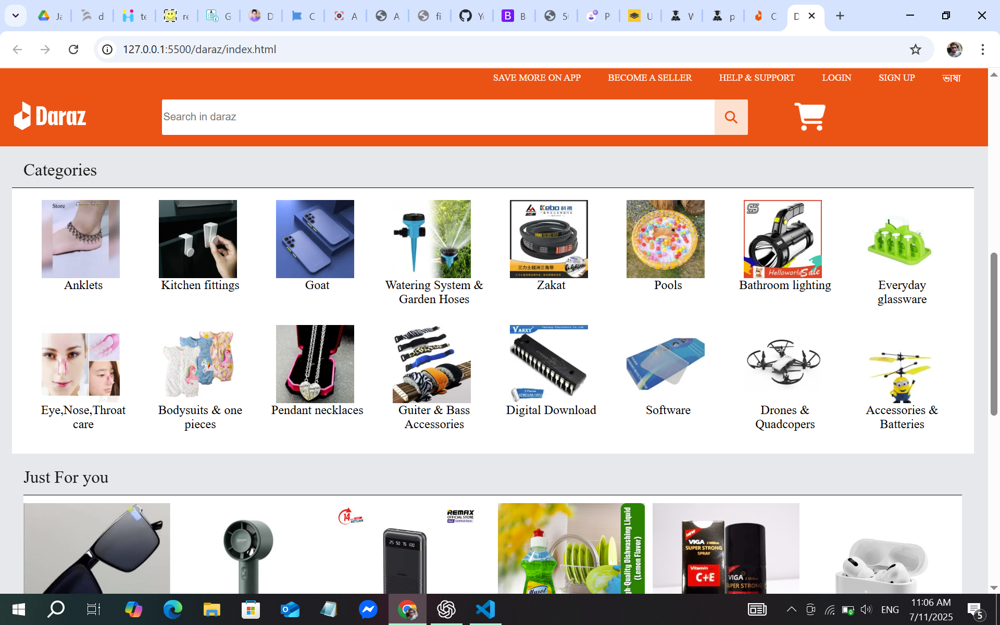
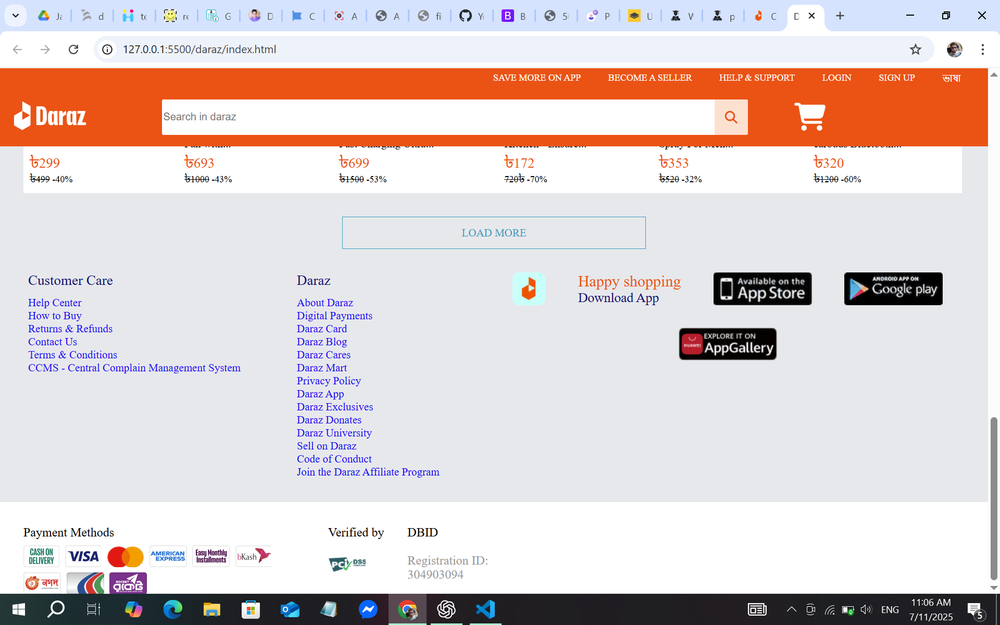
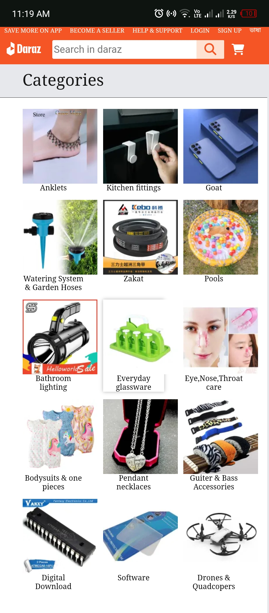
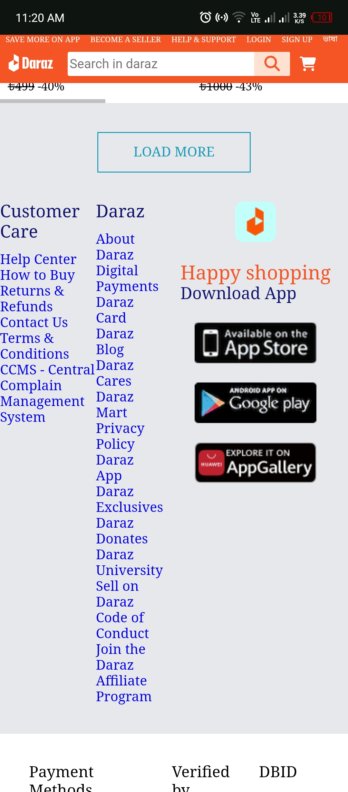

# 🛒 Daraz Homepage Clone

A fully responsive clone of the Daraz homepage built with **HTML**, **CSS**, and **Font Awesome**.  
This project was created to practice frontend layout design and responsiveness using `@media` queries.

---

## 📱 Responsive Design

This project works on:
- ✅ Desktop
- ✅ Tablet
- ✅ Mobile

Responsive styles are handled using `@media(max-width: 700px)` for mobile views.

---

## 🚀 Features

- Fixed navigation bar with logo and search
- Product cards with images, names, prices & discounts
- Scrollable product section for small screens
- Category section with icons
- Footer with helpful links and app download section
- Payment methods and verification display
- Modern, clean layout using Flexbox
- Font Awesome icons for cart and search
- Background images applied with `background-image` in CSS

---

## 🧰 Technologies Used

- HTML5
- CSS3 (with Flexbox and Media Queries)
- Font Awesome CDN

---

## 📁 Folder Structure

```
daraz-homepage-clone/
├── index.html
├── style.css
├── README.md
├── product_img/
│   ├── sunglasses.png
│   ├── fan.png
│   └── ...
├── logo/
│   └── logo.png
└── screenshots/
    ├── desktop-1.png
    ├── desktop-2.png
    ├── desktop-3.png
    ├── mobile-1.png
    ├── mobile-2.png
    └── mobile-3.png

```
---

## 🖼️ Screenshots

### 💻 Desktop Views

1. Desktop View 1  


2. Desktop View 2  


3. Desktop View 3  


---

### 📱 Mobile Views

1. Mobile View 1  


2. Mobile View 2  


3. Mobile View 3  



## 🔗 Live Preview

👉 [Live Site](https://nafis-cse.github.io/daraz-homepage-clone)

---

## 👨‍💻 Author

**Shahariyar Nafis**  
GitHub: [@Nafis-CSE](https://github.com/Nafis-CSE)

---

## 📜 License

This project is built for educational purposes only.  
Not affiliated with or endorsed by Daraz.

